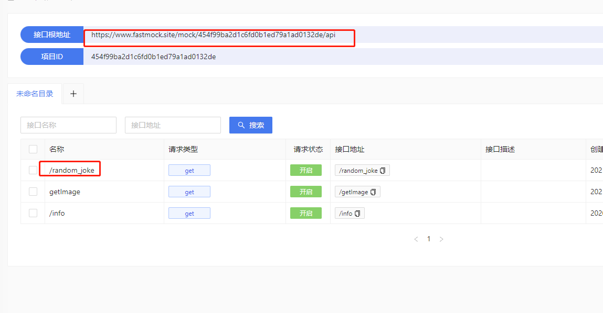
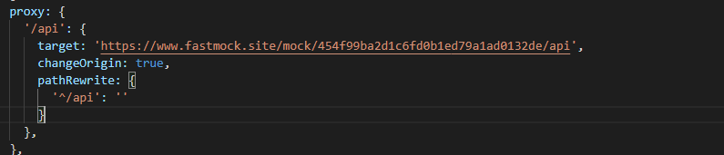
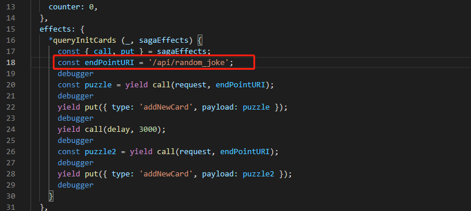

### fase mock 使用







```
effects: {
  *queryInitCards (_, sagaEffects) {
    const { call, put } = sagaEffects;
    const endPointURI = '/api/random_joke';
    debugger
    const puzzle = yield call(request, endPointURI);
    debugger
    yield put({ type: 'addNewCard', payload: puzzle });
    debugger
    yield call(delay, 3000);
    debugger
    const puzzle2 = yield call(request, endPointURI);
    debugger
    yield put({ type: 'addNewCard', payload: puzzle2 });
    debugger
  }
}
```


```
proxy: {
  '/api': {
    target: 'https://www.fastmock.site/mock/454f99ba2d1c6fd0b1ed79a1ad0132de/api',
    changeOrigin: true,
    pathRewrite: {
      '^/api': ''
    }
  },
},
```